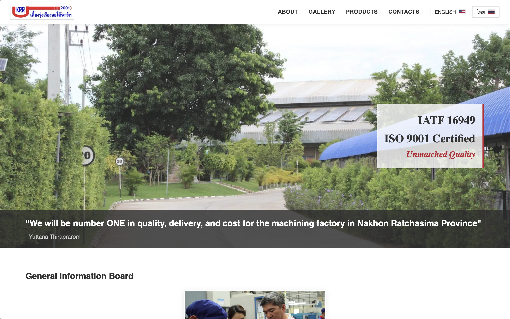

# 🌐 Keing Rung Ruang Auto Part (Frontend Architecture)

> The official corporate frontend for Keing Rung Ruang Auto Part (2001) Co., Ltd., a manufacturing plant specializing in automotive and air compressor parts.

**🟢 [Live Vercel Deployment](https://website-frontend-xi-three.vercel.app/)**


*A responsive, bilingual corporate landing page and product gallery.*

---

## 🛠️ Tech Stack

This project was built without heavy frameworks to prioritize blazing-fast load times and straightforward long-term maintainability.

* **Markup & Styling:** HTML5, CSS3 (Custom Responsive Grid/Flexbox layouts)
* **Interactivity:** Vanilla JavaScript (DOM manipulation, modal handling)
* **Deployment:** Vercel

---

## ⚙️ Core Features

* **Bilingual Support (i18n):** Engineered a custom JavaScript language toggle allowing seamless switching between English and Thai (`languages.js`) without requiring page reloads.
* **Responsive Product Galleries:** Built dynamic, responsive CSS grids to showcase hundreds of manufactured parts across Automotive, Motorcycle, and Agricultural sectors.
* **Interactive Modals:** Implemented custom image-expansion modals for detailed product viewing.
* **SEO & Deployment Configuration:** Configured `robots` meta tags for portfolio hosting protection and deployed via Vercel's edge network.

---

## 🚀 How to Run Locally

Because this project uses vanilla web technologies, there are no heavy dependencies or `node_modules` to install.

1. **Clone the repository:**
   ```bash
   git clone [https://github.com/Saakdo/website-frontend.git](https://github.com/Saakdo/website-frontend.git)
